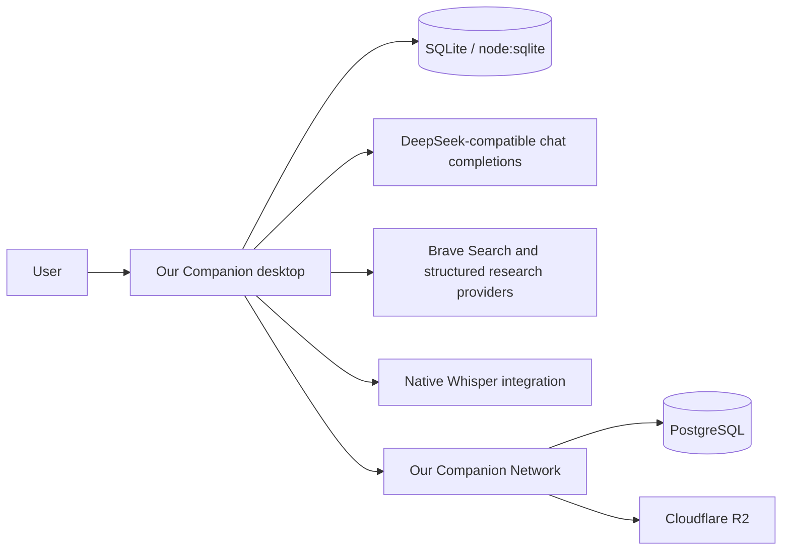
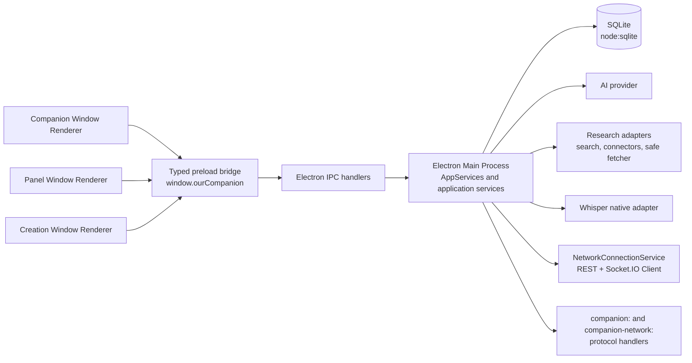
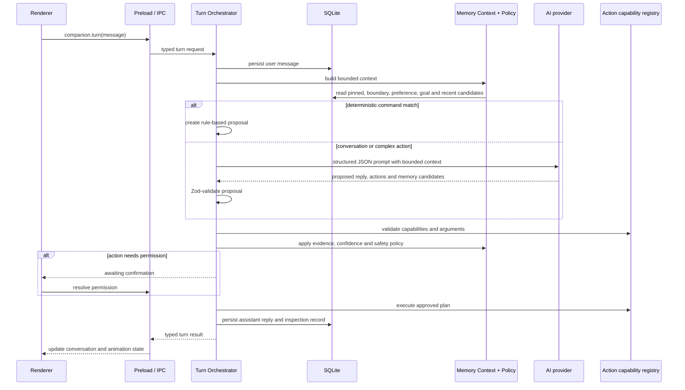
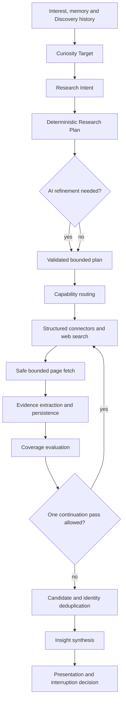
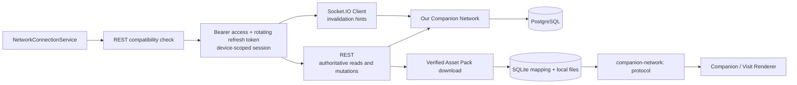

# Our Companion desktop architecture overview

This document describes the implementation in the `client` repository. The Main Process is the trust boundary for local data, capabilities and external integrations; the React Renderer is a presentation and interaction layer.

## 1. System Context

Our Companion is a local-first desktop AI companion runtime. A local Companion can animate, converse, retain bounded memory, execute approved structured actions and run autonomous Discovery without a Network account. Online Mode connects the same local runtime to Our Companion Network for identity, friends, presence, public Companion publication, Asset Packs, Visits and opt-in Developer Debug upload.



## 2. Desktop Process Architecture

The application creates three windows: Companion, Panel and Creation. Each window uses a sandboxed Renderer and the same typed preload surface.



`contextIsolation`, `sandbox` and `nodeIntegration: false` are enabled for the windows. Renderer code receives capabilities through explicit preload methods and IPC channels rather than Node.js access.

## 3. Main Process Responsibilities

The Main Process composes the local runtime and owns:

- SQLite initialization, schema migration and all durable local data.
- Companion profile/runtime state, conversation, memory, actions and permissions.
- AI provider calls and structured response parsing.
- Discovery scheduling, research planning, connectors, safe page fetching and evidence persistence.
- Native Whisper lifecycle and speech transcription.
- Local Companion filesystem access through constrained protocol handlers.
- Network authentication, compatibility, REST calls, Socket.IO invalidations, Asset Pack transfer and Visit reconciliation.
- Developer Debug redaction, queueing, upload gating and batch flushing.

`services.ts` remains a relatively large composition root. Narrower application services under `electron/main/application/` and domain packages keep most behavior testable outside the Electron entry point.

## 4. Renderer Responsibilities

React owns view state and user interaction. The Renderer selects the Companion, Panel or Creation shell, renders Canvas animation, displays conversation and Discovery results, collects settings and confirmations, and requests operations through `window.ourCompanion`.

The Renderer may render a cached asset through the `companion:` or `companion-network:` URL, but it does not receive arbitrary filesystem paths. It does not open sockets, call AI providers, query SQLite or execute operating-system commands directly.

## 5. IPC and Security Boundary

```text
Renderer event or request
  -> typed preload method
  -> ipcMain handler
  -> Main Process service
  -> local database / adapter / external request
  -> typed result or broadcast event
```

The preload bridge exposes grouped capabilities such as `companion`, creation, settings, Discovery, Network and Developer Debug. IPC authorization is performed by the relevant handlers and services, but validation is not yet centralized into one schema registry for every channel. That is a maintainability boundary, not a reason to give the Renderer Node.js capabilities.

The Main Process registers the constrained `companion:` and `companion-network:` protocols. Their handlers validate companion, session, Asset Pack and relative asset paths before serving bytes.

## 6. Companion Turn Sequence



The LLM proposes; deterministic code validates, authorizes and executes. An action plan can be rejected for an unsupported tool, invalid arguments, denied permission or adapter failure. A memory candidate must be grounded in the current user message and pass the local safety policy.

## 7. Memory Retrieval and Capture

Memory retrieval is a bounded SQLite selection algorithm, not vector search:

1. Read a bounded candidate set and discard marked-wrong or expired items.
2. Reserve pinned memories and typed user boundaries, preferences and goals.
3. Score remaining candidates by keyword overlap, including CJK bigrams.
4. Use importance and recency for ties and as a fallback.
5. Enforce maximum item and character budgets before building the prompt.

Capture uses explicit or AI-proposed candidates, but the policy checks evidence grounding, confidence, sensitive patterns, temporary language and explicit non-memory instructions. Fingerprints allow idempotent upsert and stronger observations to update existing nodes. An undo token can restore a previous node or remove a newly created node.

## 8. Discovery Research Sequence



Resource controls include query, result, page, character, request-timeout and cycle-deadline limits. Fetches are batched by domain where possible. Provider failures become bounded research failures, not unbounded retries. Seen canonical URLs, content hashes and semantic fingerprints reduce repeated work.

The `SafeWebPageFetcher` allows only HTTP and HTTPS, rejects URL credentials, blocks localhost, private and link-local addresses across IPv4 and IPv6, validates DNS answers, uses DNS-pinned transport, revalidates each redirect, enforces response-size limits and accepts only supported HTML, text, RSS and Atom content types. Cheerio extracts bounded page/feed text.

## 9. Character Runtime and Animation

`CompanionCanvas` owns the Canvas surface and uses `SpriteAnimator` to load a spritesheet, calculate frames and draw the current frame. It scales the backing canvas for device pixel ratio, controls playback rate for walking, supports looping and one-shot clips, invokes completion callbacks and falls back when an asset is unavailable.

Interaction is tied to the rendered pixels: alpha-based hit testing ignores transparent areas, while pointer capture supports dragging and a release animation. Directional walk clips use the requested facing and playback rate. This is the active rendering path; PixiJS is not involved in the active Companion Canvas path.

## 10. Local Persistence

`packages/database` creates the base schema through `sqliteSchema` and then runs adaptive Discovery initialization. The current startup path creates 35 base tables plus `discovery_seen_identity`, `discovery_bases` and `discovery_base_feedback`, for 38 persistent tables in total.

The major groups are Companion/runtime state, conversation, memory graph, relationships, Discovery and research, curiosity/patterns/interests, journeys/diary, traces/tasks, Network mappings and verified Asset Pack cache, Developer Debug events and settings. SQLite is local persistence; the current implementation does not claim full-database encryption.

## 11. Online Mode Integration



The Main Process checks the protocol/client version, restores a device-scoped session through Electron `safeStorage` when encryption is available, refreshes tokens on authentication errors and reconnects with bounded backoff. Socket events increment a social revision and trigger authoritative REST reloads. A reconnect or socket gap causes Visit reconciliation from the server.

## 12. Network Asset Cache

For a Visit or remote Companion, the Main Process obtains the authoritative manifest and presigned download URLs, downloads only the requested files, validates expected size/hash metadata, writes them into a local cache and records the mapping in `network_asset_cache`. Cache entries include server origin, Asset Pack ID, Companion ID, manifest hash, byte count, last-used time, pin state and verification state.

The constrained `companion-network:` protocol resolves only an approved session/pack/relative asset reference. The Renderer sees a protocol URL, not a local path. Cache invalidation follows authoritative Companion/Asset Pack and Visit state.

## 13. Developer Debug Pipeline

Main-process events are first written to the local `developer_debug_events` queue. The client redacts credential-like keys and text, truncates fields, bounds individual payloads and batches uploads. Upload is disabled for packaged builds and is allowed only when Online Mode is online, an account is authenticated, the local Developer Debug setting is enabled and the server feature flag accepts ingestion.

The Network associates events with the authenticated user/device, redacts again, deduplicates by `(userId, clientEventId)`, retains them for a bounded period and exposes them only through Superadmin inspection and audit surfaces.

## 14. Testing Strategy

- TypeScript project checks via `npm run typecheck`; the root `lint` script is also a TypeScript check, not ESLint.
- Vitest unit, integration and application-service tests.
- Playwright UI and accessibility checks through `@axe-core/playwright`.
- Architecture-boundary tests for process/package dependency rules.
- Deterministic fake AI, research, renderer, tools, clock and fixture support.
- Two-device Visit smoke coverage and multi-visitor smoke coverage when the Electron and Network environment is available.

Tests that require Electron, PostgreSQL, storage or a running Network are environment-dependent and should not be described as passed unless they were actually run.

## 15. Known Scaling and Maintainability Boundaries

- The Main Process composition root remains large and is a candidate for further service decomposition.
- IPC validation is explicit at many boundaries but not centralized in one schema registry.
- SQLite is local-first and single-device; Network synchronization is an explicit online integration.
- Socket.IO events are invalidation hints and depend on the Network's current in-process connection ownership.
- External provider reliability, presigned transfers and storage availability affect Discovery, speech and social features.
- Packaging, signing, installers and automatic updates remain production-delivery work rather than assumptions of this architecture.
